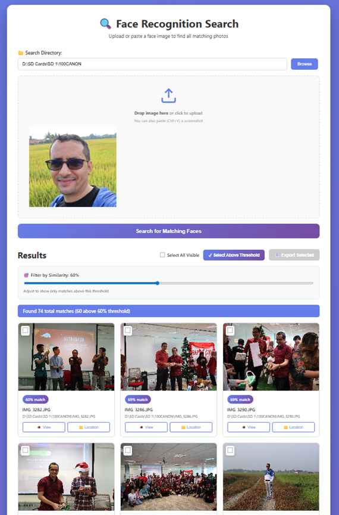

# 🔍 Face Recognition Search Web Application


> **GPU-accelerated face recognition search - Upload a face and instantly find all matching photos across thousands of images**A web application that allows you to search for photos of a specific person in a directory by uploading or pasting a face image.


A high-performance web application that searches through large photo collections by face similarity. Simply upload or paste a face image, and the system rapidly scans thousands of photos using GPU acceleration to find all matching faces with real-time streaming results.## Features


- 🖼️ **Upload or Paste Images**: Drag & drop, click to upload, or paste screenshots (Ctrl+V)

- � **GPU-Accelerated Deep Learning**: Uses FaceNet with PyTorch for state-of-the-art face recognition

## ✨ Key Features- 📁 **Recursive Directory Search**: Searches through all subdirectories

- ⚡ **Multi-threaded Processing**: Processes images in parallel for faster results

### 🚀 Performance- 📊 **Similarity Scores**: Shows match percentage for each found image

- **GPU-Accelerated Processing**: CUDA-powered face recognition (RTX 3080 optimized)- 🎨 **Modern UI**: Clean, responsive interface with gradient design

- **Real-time Streaming Results**: Matches appear instantly as they're found

- **Live Progress Tracking**: Visual progress bar showing files processed## Installation

- **High-Speed Processing**: ~12 images/second with GPU acceleration

- **Batch Processing**: Handles thousands of images efficiently (1500/batch, 12 workers)### Current Setup (Python 3.10 + Virtual Environment)


### 🎯 Face Detection & RecognitionThe application uses:

- **Advanced Face Detection**: InsightFace buffalo_l model with dual analyzers- Flask (web framework)

- **Optimized for Cropped Images**: Automatic upscaling and padding for screenshots- PyTorch with CUDA support (GPU acceleration)

- **Ultra-Low Detection Threshold**: 0.01 threshold for query images (handles challenging crops)- facenet-pytorch (advanced face recognition with MTCNN + InceptionResnetV1)

- **Smart Preprocessing**: 20% padding + upscaling for optimal detection- Pillow (image handling)

- **Cosine Similarity Matching**: 512-dimensional face embeddings- Virtual environment at `venv/`


### 🎨 User Interface### System Requirements

- **Drag & Drop Upload**: Or click to browse, or paste (Ctrl+V) screenshots

- **Adjustable Similarity Filter**: Real-time threshold adjustment (30-95%)- Python 3.10

- **Bulk Selection Tools**: Select All, Select Above Threshold- NVIDIA GPU with CUDA support (optional but recommended)

- **Export Functionality**: Copy selected images to destination folder with duplicate handling- Visual C++ Redistributable 2015-2022

- **Image Viewer Popup**: Full-screen image preview with details- 8GB+ RAM recommended

- **Open Location**: One-click to view file in Windows Explorer

- **Responsive Grid Layout**: Modern, gradient-themed interface## How to Use


## 🖥️ System Requirements1. **Start the application**:

   ```

### Hardware   venv\Scripts\python.exe app_gpu.py

- **GPU**: NVIDIA GPU with CUDA support (RTX 3080 recommended)   ```

- **RAM**: 8GB+ recommended (16GB+ for large datasets)

- **Storage**: 2GB for models and dependencies2. **Open your browser** and go to:

   ```

### Software   http://localhost:5000

- **Python**: 3.10 or 3.13   ```

- **CUDA**: 12.6

- **cuDNN**: 9.153. **Enter the directory path** where you want to search for photos

- **OS**: Windows 10/11 (tested), Linux (compatible)   - Example: `C:\Users\YourName\Pictures`

   - Example: `D:\Photos\Vacation`

## 📦 Installation

4. **Upload or paste a face image**:

### 1. Clone the Repository   - Click the upload area to select a file

```bash   - Drag and drop an image

git clone https://github.com/bassalemi/face-recognition-search.git   - Press Ctrl+V to paste a screenshot

cd face-recognition-search

```5. **Click "Search for Matching Faces"**


### 2. Set Up Python Virtual Environment6. **View results** with similarity scores and file locations

```bash

python -m venv venv## How It Works

venv\Scripts\activate  # Windows

# source venv/bin/activate  # Linux/Mac1. **MTCNN Face Detection**: Detects and aligns faces in images

```2. **FaceNet Embeddings**: Extracts 512-dimensional face embeddings using InceptionResnetV1 trained on VGGFace2

3. **Cosine Similarity**: Compares face embeddings using cosine distance

### 3. Install Dependencies4. **Multi-threaded Processing**: Processes images in batches for optimal GPU utilization

```bash5. **Results sorted by similarity** (highest match percentage first)

pip install flask insightface onnxruntime-gpu opencv-python numpy

```## Files in this Project


### 4. Install CUDA & cuDNN- `app_gpu.py` - GPU-accelerated version using FaceNet (recommended)

See detailed instructions in [GPU_SETUP.md](GPU_SETUP.md) and [INSTALL_INSIGHTFACE.md](INSTALL_INSIGHTFACE.md)- `app.py` - CPU version with multiprocessing using OpenCV

- `templates/index.html` - Web interface

### 5. Run the Server- `static/style.css` - Styling

**Option 1**: Double-click `start_server.bat` (Windows)- `venv/` - Python 3.10 virtual environment


**Option 2**: Manual start## Supported Image Formats

```bash

# Set CUDA paths (Windows)- JPEG (.jpg, .jpeg)

set PATH=C:\Program Files\NVIDIA\CUDNN\v9.15\bin\12.9;C:\Program Files\NVIDIA GPU Computing Toolkit\CUDA\v12.6\bin;%PATH%- PNG (.png)

- BMP (.bmp)

# Run server- GIF (.gif)

python app.py- TIFF (.tiff)

```- WebP (.webp)


### 6. Open Browser## Configuration

Navigate to: **http://localhost:5000**

You can adjust the similarity threshold in `app_gpu.py`:

## 🚀 Quick Start Guide- Default: `threshold=70` (0-100 scale)

- Lower value = fewer but more accurate matches

1. **Launch the server** using `start_server.bat` or `python app.py`- Higher value = more matches but may include false positives

2. **Open http://localhost:5000** in your browser

3. **Enter search directory** (e.g., `D:\Photos` or `C:\Users\YourName\Pictures`)## Notes

4. **Upload or paste a face image**:

   - Drag & drop an image- First run will download FaceNet models (~100MB) automatically

   - Click to browse files- GPU version is significantly faster if CUDA is available

   - Press Ctrl+V to paste a screenshot- CPU version will work but processes slower

5. **Click "Search for Matching Faces"**- Processing time depends on the number of images and hardware

6. **Watch real-time results** appear with similarity scores- The app shows progress updates as batches are processed

7. **Adjust threshold slider** to filter results (30-95%)

8. **Select and export** matches to a folder## Troubleshooting


## 🛠️ Technology Stack**Issue**: No faces detected in reference image

- Make sure the uploaded image clearly shows a face

### Backend- Try a different image with better lighting

- **Flask** - Lightweight Python web framework

- **Python 3.13** - Modern Python with optimized performance**Issue**: Search takes too long

- **Server-Sent Events (SSE)** - Real-time result streaming- Reduce the directory size or specify a more specific subdirectory

- The app processes images sequentially for accuracy

### AI & Face Recognition

- **InsightFace** - State-of-the-art face recognition library**Issue**: Images not displaying in results

- **buffalo_l Model** - High-accuracy face detection and embedding- This is normal - browsers restrict local file access

- **ONNX Runtime** - GPU-accelerated inference engine- Use the "Copy Path" button to get the file location

- **Cosine Similarity** - Face embedding comparison- Navigate to the path in Windows Explorer


### GPU Acceleration## Technology Stack

- **CUDA 12.6** - NVIDIA parallel computing platform

- **cuDNN 9.15** - Deep neural network library- **Backend**: Flask (Python web framework)

- **CUDAExecutionProvider** - ONNX Runtime GPU backend- **Face Detection**: MTCNN (Multi-task Cascaded Convolutional Networks)

- **FP16 Precision** - Half-precision for faster computation- **Face Recognition**: FaceNet (InceptionResnetV1 trained on VGGFace2)

- **Deep Learning**: PyTorch with CUDA support

### Image Processing- **Image Processing**: Pillow

- **OpenCV** - Computer vision and image manipulation- **Frontend**: HTML5, CSS3, JavaScript

- **NumPy** - Numerical computing for embeddings- **Concurrency**: ThreadPoolExecutor for parallel processing

- **INTER_CUBIC** - High-quality image upscaling
- **BORDER_REPLICATE** - Edge padding technique

### Frontend
- **HTML5** - Modern semantic markup
- **CSS3** - Gradients, animations, responsive design
- **Vanilla JavaScript** - Fetch API with ReadableStream for SSE

## 📊 Performance Metrics

| Metric | Value |
|--------|-------|
| **Processing Speed** | ~12 images/second (GPU) |
| **Batch Size** | 1500 images/batch |
| **Concurrent Workers** | 12 threads |
| **Detection Threshold** | 0.01 (query), 0.15 (directory) |
| **Detection Size** | 640x640 (query), 1280x1280 (directory) |
| **Upload Limit** | 16MB max file size |
| **Supported Formats** | .jpg, .jpeg, .png, .bmp |

## 🔧 Configuration

### Adjust Detection Settings
Edit `app.py` to customize:

```python
# Query image analyzer (for uploaded faces)
face_analyzer_query.prepare(
    ctx_id=0,
    det_size=(640, 640),    # Detection resolution
    det_thresh=0.01         # Lower = more permissive
)

# Directory image analyzer (for photo library)
face_analyzer.prepare(
    ctx_id=0,
    det_size=(1280, 1280),  # Detection resolution
    det_thresh=0.15         # Higher = more strict
)
```

### Adjust Performance
```python
batch_size = 1500           # Images per batch
max_workers = 12            # Concurrent threads
```

### Adjust Upload Limit
```python
app.config['MAX_CONTENT_LENGTH'] = 16 * 1024 * 1024  # 16MB
```

## 📁 Project Structure

```
face-recognition-search/
├── app.py                      # Main Flask application
├── start_server.bat            # Windows launcher with CUDA paths
├── templates/
│   └── index.html             # Web interface
├── static/
│   └── style.css              # Styling and animations
├── screenshots/
│   └── demo.png               # Demo screenshot
├── README.md                   # This file
├── PROJECT_OVERVIEW.md         # Detailed project documentation
├── GPU_SETUP.md               # GPU setup instructions
├── INSTALL_INSIGHTFACE.md     # InsightFace installation guide
└── .gitignore                 # Git ignore rules
```

## 🎯 Use Cases

- 📸 **Personal Photo Libraries**: Find all photos of family members across years
- 🎉 **Event Photography**: Locate all images of specific attendees
- 👪 **Family Archives**: Organize historical family photos
- 💼 **Professional Photography**: Client photo management workflows
- 🔍 **Photo Organization**: Deduplicate and categorize large collections

## 🐛 Troubleshooting

### No Face Detected in Query Image
- Ensure the image clearly shows a face
- Try cropping closer to the face
- Check image quality and lighting
- The system auto-upscales small images, but very low quality may fail

### Slow Performance
- Verify GPU is being used (check startup message: "✅ GPU ENABLED")
- Reduce search directory scope
- Close other GPU-intensive applications
- Check CUDA/cuDNN installation (see [GPU_SETUP.md](GPU_SETUP.md))

### No Results Found
- Lower the similarity threshold slider (try 30%)
- Verify the search directory path is correct
- Ensure directory contains supported image formats (.jpg, .png, .bmp)
- Check if faces are visible in directory images

### Module Import Errors
```bash
# Reinstall dependencies
pip install --force-reinstall insightface onnxruntime-gpu opencv-python
```

### CUDA Not Detected
- Verify CUDA installation: `nvidia-smi`
- Check PATH includes CUDA bin directory
- See [GPU_SETUP.md](GPU_SETUP.md) for detailed setup

## 📄 License

This project is open source and available under the MIT License.

## 🤝 Contributing

Contributions, issues, and feature requests are welcome!

## 👤 Author

**Bassam**
- GitHub: [@bassalemi](https://github.com/bassalemi)
- Email: bassalemi@gmail.com

## ⭐ Show Your Support

Give a ⭐️ if this project helped you!

## 📚 Additional Documentation

- [Project Overview](PROJECT_OVERVIEW.md) - Comprehensive functionality and technology breakdown
- [GPU Setup Guide](GPU_SETUP.md) - Detailed CUDA/cuDNN installation
- [InsightFace Installation](INSTALL_INSIGHTFACE.md) - Step-by-step InsightFace setup

---

*Built with ❤️ using modern AI and GPU acceleration technologies*
